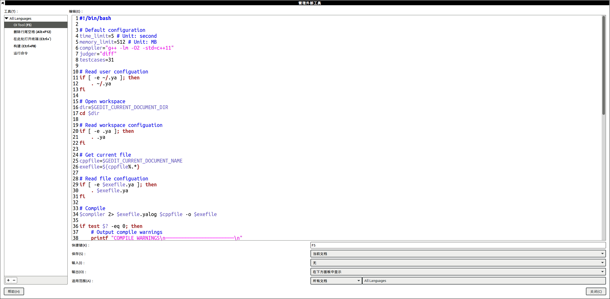
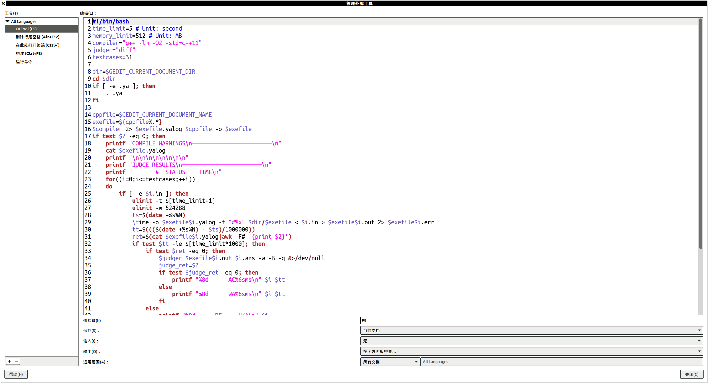

# OI Tool(v1.0)

A gedit plugin which can test OI codes.

## Requirements

- Operating system: Linux
- Do **NOT** put files with extension `ya` or `yalog` in the same folder with your code.

## Installation

1. Open Gedit and enable the plugin "external tools".
   
2. Manage "external tools".
   
3. Insert the code from `oi.sh` and config the new tool as shown in the picture.
   

## Usage

1. Open your code. Let its name be `<name>.<ext>`.
2. Put your testcases in `<i>.in` and `<i>.ans`. (`<i>` is the ID of the testcases, ranging in $[0,\mathrm{testcases}]$)
3. Press `F5`.
4. You can see the results in the panel below.
   Judge results are: `AC`(Answer correct), `WA`(Wrong answer), `TLE`(Time limit exceeded) and `RE`(Runtime error).
   Your `stdout` and `stderr` are directed to `<name><i>.out` and `<name><i>.err` respectively.

## Settings

Create a file named `.ya` in your folder. It should be like:

```sh
time_limit=5 # Time limit of your code. Unit: second
memory_limit=512 # Memory limit of your code. Unit: MB
compiler="g++ -lm -O2 -std=c++11" # Compiler of your code together with the arguments.
judger="diff" # Special judge of your code. 
              # Usage:
              # - Argument #1: output file.
              # - Argument #2: answer file.
			  # You can find the input file from the answer file's name.
              # - Return 0 if AC and non-zero if WA.
testcases=31 # Maximum ID of testcases
```